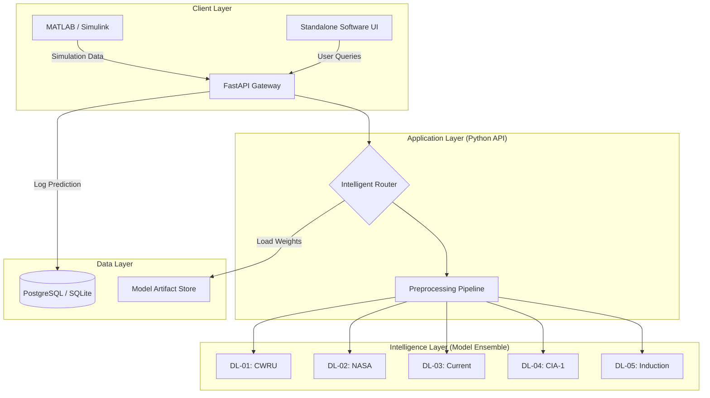

# Digital Twin Predictive Maintenance System
## Advanced Technical Implementation Roadmap

**Document Version:** 1.1
**Date:** 2025-11-29
**Architecture Pattern:** API-First / Microservices-Ready

---

## 1. Executive Summary

This document outlines the technical strategy for developing a standalone **Digital Twin Predictive Maintenance Software Suite**. The system utilizes an **Ensemble of Deep Learning (DL) Models** to provide high-accuracy fault detection across diverse motor conditions.

The architecture follows an **API-First approach**, where a centralized Python backend serves as the "Intelligence Core," providing standardized prediction services to two distinct clients:
1.  **MATLAB/Simulink:** For rigorous simulation, validation, and "Digital Twin" testing.
2.  **Standalone Software Frontend:** For the final user-facing product (Dashboard).

---

# 2. The AI Core: Ensemble of 6 DL Models

We explicitly leverage the following **6 Deep Learning Models**, each serving as a "Specialist" for specific data types or fault scenarios.

| Model ID | Dataset / Source | Architecture | Specialization | Input Data Type |
| :--- | :--- | :--- | :--- | :--- |
| **DL-01** | **CWRU Bearing Data** | CNN (1D) | **Bearing Faults** (Inner/Outer Race, Ball) | Vibration (Drive End / Fan End) |
| **DL-02** | **NASA IMS** | LSTM / CNN | **Run-to-Failure** / RUL Estimation | Vibration (Time-Series) |
| **DL-03** | **Current Signature** | CNN / MLP | **Electrical Faults** (MCSA) | Stator Current (3-Phase) |
| **DL-04** | **CIA-1 Dataset** | Hybrid DL | **Complex Industrial Faults** | Multi-sensor Fusion |
| **DL-05** | **Induction Motor** | Advanced CNN | **General Motor Faults** (7 Classes) | Vibration + Current (2-Channel) |
| **DL-06** | **Thermal Imaging / Thermal** | CNN / Vision Model | **Thermal Anomalies & Overheating** | Thermal images / Temperature maps |

**Strategy:** An **Intelligent Router** within the API will dynamically select the appropriate model based on the incoming request's metadata (e.g., `motor_id`, `sensor_config`).

---

## 3. System Architecture & Communication Protocols

### 3.1 High-Level Architecture



### 3.2 Communication Protocols

We will utilize two distinct communication protocols to handle different system requirements:

#### A. REST API (HTTP/1.1)
*   **Usage:** Primary communication for MATLAB simulation and standard UI interactions.
*   **Format:** JSON (JavaScript Object Notation).
*   **Endpoint:** `POST /api/v1/predict`
*   **Why:** Universal compatibility. MATLAB `webwrite` and React `fetch` both support it natively. It is stateless and robust.

#### B. WebSockets (WS)
*   **Usage:** Real-time data streaming for the Frontend Dashboard.
*   **Format:** Binary or JSON streams.
*   **Endpoint:** `ws://api/v1/stream`
*   **Why:** Low latency (<50ms). Essential for visualizing live sensor data graphs without "polling" the server repeatedly.

---

## 4. Seamless MATLAB Integration (Auto-Start)

To ensure the API runs "alongside" MATLAB automatically, we will implement a **Process Management** strategy. You do not need to manually start the server every time.

**How it works:**
1.  **MATLAB Startup:** When you open your project or run the simulation `init` script, MATLAB checks if the API is running.
2.  **Auto-Launch:** If the API is not found, MATLAB executes a system command to launch the Python server in the background.
3.  **Simulation Loop:** The simulation runs, making HTTP requests to the local server.
4.  **Cleanup:** When MATLAB closes (or via an `onCleanup` object), it sends a kill signal to the Python server.

**MATLAB Code Example:**
```matlab
% In your init_simulation.m
[status, result] = system('tasklist /FI "IMAGENAME eq python.exe"');
if contains(result, 'No tasks')
    disp('Starting AI Engine...');
    system('start /B python -m uvicorn src.main:app --port 8000');
    pause(5); % Wait for server to boot
end
```

---

## 5. Advantages & Disadvantages of API-First Approach

### ✅ Advantages
1.  **Decoupling:** The AI logic is completely separate from the UI and Simulation. You can upgrade a DL model without touching the MATLAB code or the Website.
2.  **Scalability:** The Python API can be deployed on a high-performance server (GPU-enabled), allowing lightweight clients (laptops, tablets) to access heavy DL models.
3.  **Single Source of Truth:** Both the Simulation (Test) and the Product (Live) use the *exact same* prediction logic. If it passes simulation, it works in production.
4.  **Language Agnostic:** The backend is Python (best for AI). The frontend is JavaScript/React (best for UI). The simulation is MATLAB. They all talk via JSON.

### ⚠️ Disadvantages
1.  **Latency:** Network communication adds overhead (10-50ms) compared to running everything inside one process. *Mitigation: Use local loopback networking (localhost) for simulation.*
2.  **Complexity:** Requires managing three components (API, Frontend, MATLAB) instead of one monolithic script. *Mitigation: Use Docker to containerize the API.*
3.  **Dependency Management:** The API server must be running for the simulation to work. *Mitigation: Use the Auto-Start script described in Section 4.*

---

## 6. Detailed Implementation Roadmap (Work Breakdown)

### Phase 1: The "Intelligence Core" (Weeks 1-2)
**Goal:** Build the Python API that serves the 6 DL models.

*   **Task 1.1: Model Standardization (Critical)**
    *   *Action:* Create a script to load each of the 5 notebooks, finalize training, and save the model (`.h5`) and scaler (`.pkl`) to a `./models/` directory.
    *   *Deliverable:* 5 Model files, 5 Scaler files, 1 `config.json` describing inputs.

*   **Task 1.2: The Preprocessing Pipeline**
    *   *Action:* Write `src/preprocessing.py`. It must handle:
        *   Downsampling (e.g., 20x for DL-05).
        *   FFT conversion (if required by DL-03).
        *   Reshaping (e.g., `(Samples, Time, Channels)`).
    *   *Deliverable:* A function `preprocess(data, model_id)` that returns model-ready tensors.

*   **Task 1.3: API Development (FastAPI)**
    *   *Action:* Create `main.py` with FastAPI.
    *   *Logic:*
        ```python
        @app.post("/predict")
        def predict(data: SensorData):
            model = router.get_model(data.motor_id)
            processed_data = preprocess(data.signal, model.id)
            prediction = model.predict(processed_data)
            return {"fault": prediction.class, "confidence": prediction.score}
        ```
    *   *Deliverable:* A running local server.

### Phase 2: Simulation Integration (Week 3)
**Goal:** Validate the "Digital Twin" concept using MATLAB.

*   **Task 2.1: MATLAB Client**
    *   *Action:* Write `predict_fault.m`.
    *   *Logic:* Use `webwrite` to send sensor arrays to `http://localhost:8000/predict`.
    *   *Deliverable:* A MATLAB function that returns a fault string.

*   **Task 2.2: Simulink Block**
    *   *Action:* Embed `predict_fault.m` into a MATLAB Function Block within your Simulink motor model.
    *   *Deliverable:* A Simulink simulation that displays "Bearing Fault" on a Scope when fault data is injected.

### Phase 3: The Software Frontend (Weeks 4-6)
**Goal:** Build the standalone product.

*   **Task 3.1: React Dashboard**
    *   *Action:* Initialize a React project. Create components for "Motor Status Card", "Real-time Graph", and "Alert Log".
    *   *Deliverable:* A web UI running on `localhost:3000`.

*   **Task 3.2: Desktop Packaging**
    *   *Action:* Use **Electron** or **PyInstaller** to bundle the Python API and React UI into a single `.exe` installer.
    *   *Deliverable:* `DigitalTwinSetup.exe`.

---

## 7. Recommendations for Improvement

1.  **Implement "Model Versioning":**
    *   *Why:* You will retrain models eventually.
    *   *How:* The API should support `/v1/predict` and `/v2/predict`. This allows you to test new models in MATLAB without breaking the live software.

2.  **Add an "Anomaly Detection" Safety Net:**
    *   *Why:* DL models are "confident but wrong" on data they haven't seen.
    *   *How:* Add a lightweight Autoencoder alongside the DL models. If the input data looks "weird" (unknown fault), the Autoencoder flags it as "Unknown Anomaly" instead of forcing a wrong classification.

3.  **Use Docker for Deployment:**
    *   *Why:* Python environment issues ("It works on my machine") are the #1 cause of failure.
    *   *How:* Create a `Dockerfile` that installs TensorFlow, FastAPI, and your models. This ensures the API runs exactly the same on your laptop, a server, or a colleague's machine.

---

**Next Steps:**
To execute **Phase 1.1**, I need to run a script to extract and save the **Induction Motor (DL-05)** and **CWRU (DL-01)** models immediately. Shall I proceed?

---

## Recent updates (2026-02-12)

The following implementation work was completed and should be reflected in ongoing development and verification tasks:

- **WebSocket API handler added:** A WebSocket endpoint for Simulink clients was implemented at `ws://<host>:8002/ws/simulink/{client_id}`. See `backend/app/api/websocket_handler.py`.
- **MATLAB client & API helper implemented:** `matlab_client/PredictiveMaintenanceClient.m` and `matlab_client/PredictiveMaintenanceAPI.m` provide the MATLAB-side WebSocket client and HTTP helpers. The client constructor now defaults to `ws://localhost:8002` for local testing.
- **Documentation reorganization:** All MATLAB documentation consolidated into `matlab_client/Matlab_docs` (now docs-only). All `.m` source files remain under `matlab_client`.
- **Python integration test harness:** `test_matlab_integration.py` was added to validate WebSocket connectivity, message formats, latency, and ground-truth acknowledgements.

### Verification status & responsibilities

- **What I can verify here (server/Python side):** I can run `python test_matlab_integration.py` in this environment to validate the API WebSocket flow and synthetic predictions.
- **What you must verify locally (MATLAB side):** Run the MATLAB example (`matlab_client/example_usage.m` or instantiate `PredictiveMaintenanceClient` in MATLAB) to validate runtime callbacks, `websocket()` compatibility, and Simulink integration.

### Short-term action items (updated)

- **Run server startup with models present:** Ensure `models/*.keras` exist and start the backend. Watch logs for "Application startup complete" and model load progress.
- **Execute Python harness:** Run:

```bash
python test_matlab_integration.py
```

- **Run MATLAB example locally:** In MATLAB, run the example or use:

```matlab
client = PredictiveMaintenanceClient();
client.connect();
pred = client.predict([0.1,0.2,0.3]);
client.sendGroundTruth(true, 2, 'bearing_wear');
client.close();
```

- **Provision DB and migrations:** Apply provided DB migration scripts and confirm ground-truth rows are persisted when `ground_truth` messages are sent.

### Notes & next update

- I will prepare DB migration scripts and a minimal Prometheus exporter by the next update (pending your approval).
- If you want, I can run the Python integration test now and share the results.

---

*(Roadmap updated to reflect current implementation progress and verification responsibilities — Feb 12, 2026)*
